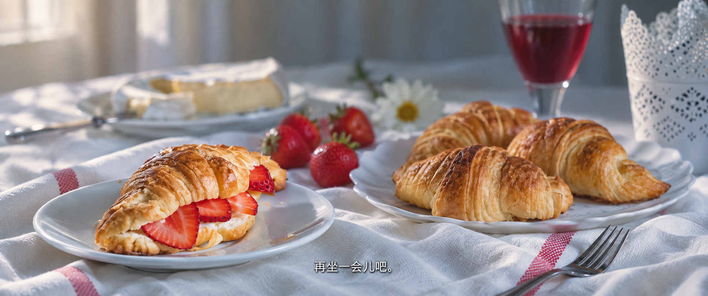
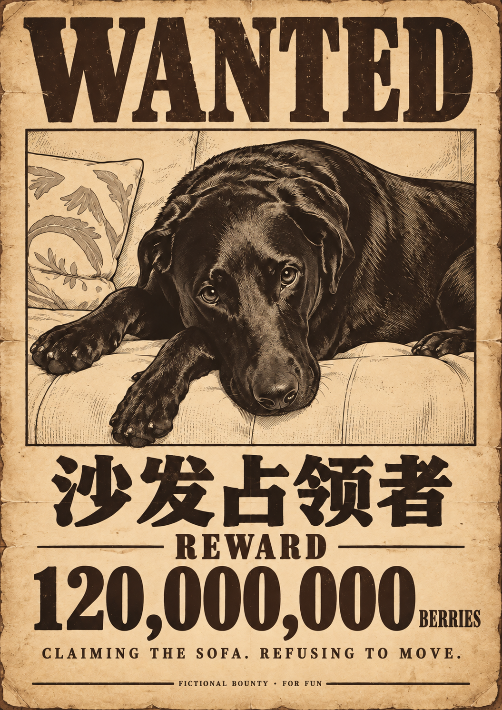
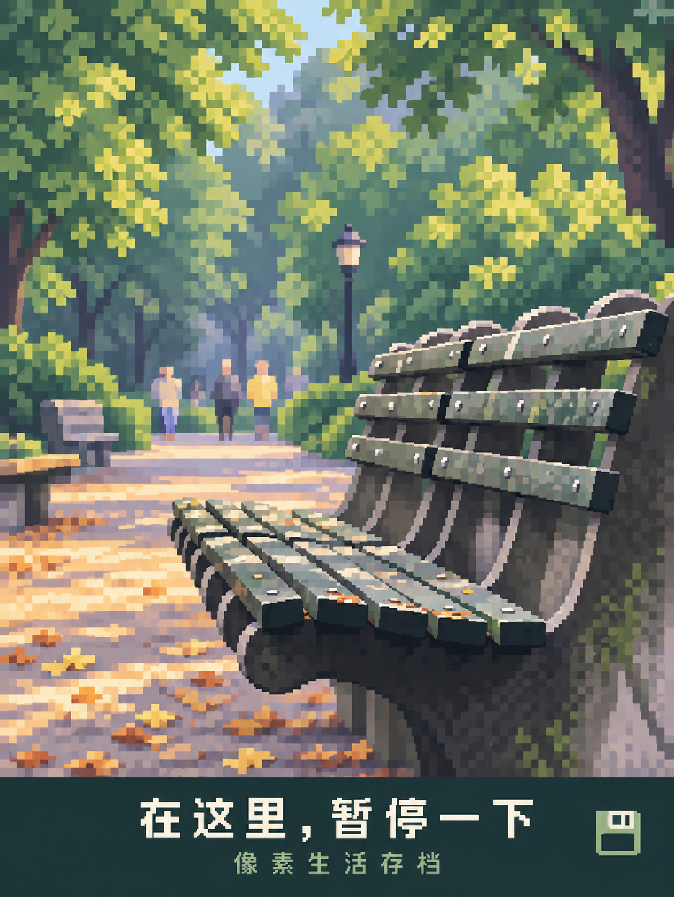

# Photo Playground · 生活照片的八种玩法

**小事可以登上头版，旧物也值得认真收藏。**

八个原创照片 Skills：冷幽默的《没什么大事日报》、温柔的《私人生活博物馆》，卡通像素风的《像素生活存档》，《大航海悬赏令》，《日常电影剧照》、《微型纸雕》、《照片记忆册》和《日常说明书》。

[English](README.en.md) · [下载 Skill](https://github.com/TREAFREE/photo-playground/releases/latest) · [查看写法](skills/small-news-daily/SKILL.md)

## 新增三款：纸雕、记忆册、说明书

新增微型纸雕、照片记忆册、日常说明书，各两个实测样例和独立 ZIP。[查看六张成品与原图对照](examples/review-2026-09-09/README.md)。

## 新玩法：日常电影剧照

用光线、构图和焦点，把日常变成电影中的一个瞬间。默认无字幕，也可以加一句你自己的台词。

[独立下载 everyday-film-still v0.1.0](https://github.com/TREAFREE/photo-playground/releases/tag/everyday-film-still-v0.1.0) · [Skill](skills/everyday-film-still/SKILL.md) · [三种题材审片](evals/everyday-film-still/review.md)

解压后将 `everyday-film-still` 放进 Skills 目录，附图输入：

> 使用 $everyday-film-still，把这张照片做成电影剧照，保留主体特征，不加字幕。

也可以指定：“加一句原创字幕：再坐一会儿吧。”电影场景属于创意重构，尚未测试人物身份保持或跨模型表现。

## 大航海悬赏令

把照片主角做成航海漫画里的悬赏人物，保留原来的神态，配上一本正经的荒诞称号。

| 摸鱼监察官 | 沙发占领者 |
|---|---|
|  |  |

[独立下载 pirate-bounty-poster v0.1.1](https://github.com/TREAFREE/photo-playground/releases/tag/pirate-bounty-poster-v0.1.1) · [Skill](skills/pirate-bounty-poster/SKILL.md) · [审片](evals/pirate-bounty-poster/review.md)

解压后将 `pirate-bounty-poster` 放进 Skills 目录，附图输入：

> 使用 $pirate-bounty-poster，把这张照片做成海贼王式悬赏令，称号和悬赏理由有一点幽默。

八款 Skill 各自包含自己的规则与资源，可单独安装和修改。[独立维护说明](docs/skill-isolation.md)。v0.4.0 集中提供八款独立安装包，原有五款规则与安装包未改动，像素版未替换。

## 像素生活存档

把自己的日常，存成复古游戏里的一幕。宠物保留辨识特征，风景保留空间关系，再用清晰的像素色块重绘。

| 今日任务：陪你摸鱼 | 在这里，暂停一下 |
|---|---|
|  |  |

[Skill 写法](skills/pixel-life-save/SKILL.md) · [像素视觉规范](skills/pixel-life-save/references/pixel-direction.md) · [实际审片](evals/pixel-review.md)

## 没什么大事日报

把照片里的小事，认真登上头版。

| 新同事已到岗，主要负责盯人 | 公开招募发呆的人 |
|---|---|
|  |  |

## 再普通一点，也可以上报纸

| 沙发使用权，暂不对外开放 | 早餐已准备好，起床另行通知 | 衣服都到齐了，还是没衣服穿 |
|---|---|---|
|  |  |  |

这五张小报是同一个 Skill 在不同照片上的实际生成结果。它先观察照片，写专属文案，再根据横竖构图排版。

## 私人生活博物馆

把普通物件做成一张有展签的收藏海报。旧鞋保留折痕，玩偶保留自己的脸；台座、光线和展陈场景重新创作。

| 折痕里的路 | 不说话的朋友 | 一口之前 |
|---|---|---|
|  |  |  |

[Skill 写法](skills/private-life-museum/SKILL.md) · [展陈规范](skills/private-life-museum/references/exhibition.md) · [实际审片](evals/museum-review.md)

## 怎么用

需要能读取 Skill 文件、查看照片并调用**参考图片编辑工具**的 Agent 环境。仅有文字聊天能力不能生成这些图片。本项目在 Codex 内置图片工具中实测，未承诺其他模型或客户端的兼容性。

在 [v0.4.0 下载页](https://github.com/TREAFREE/photo-playground/releases/tag/v0.4.0) 选择需要的独立 ZIP。解压后将同名文件夹放进个人 Skills 目录；Codex 当前文档推荐 `~/.agents/skills`。若已存在同名文件夹，先备份自己的修改再更新。八款可以分别安装，不需要全部安装。

| 玩法 | 独立安装包 |
|---|---|
| 没什么大事日报 | [small-news-daily.zip](https://github.com/TREAFREE/photo-playground/releases/download/v0.4.0/small-news-daily.zip) |
| 私人生活博物馆 | [private-life-museum.zip](https://github.com/TREAFREE/photo-playground/releases/download/v0.4.0/private-life-museum.zip) |
| 像素生活存档 | [pixel-life-save.zip](https://github.com/TREAFREE/photo-playground/releases/download/v0.4.0/pixel-life-save.zip) |
| 大航海悬赏令 | [pirate-bounty-poster.zip](https://github.com/TREAFREE/photo-playground/releases/download/v0.4.0/pirate-bounty-poster.zip) |
| 日常电影剧照 | [everyday-film-still.zip](https://github.com/TREAFREE/photo-playground/releases/download/v0.4.0/everyday-film-still.zip) |
| 微型纸雕 | [paper-scene-diorama.zip](https://github.com/TREAFREE/photo-playground/releases/download/v0.4.0/paper-scene-diorama.zip) |
| 照片记忆册 | [photo-memory-book.zip](https://github.com/TREAFREE/photo-playground/releases/download/v0.4.0/photo-memory-book.zip) |
| 日常说明书 | [everyday-user-manual.zip](https://github.com/TREAFREE/photo-playground/releases/download/v0.4.0/everyday-user-manual.zip) |

也可以直接对能访问本地文件的 Codex 说：

> 请从这个仓库安装 paper-scene-diorama Skill，保留它自己的文件夹和资源。如果已安装同名版本，先告诉我。

或者无需安装，直接提供具体 `skills/名称/SKILL.md` 的本地路径，要求读取规则和引用资源后处理附图。Skill 提供创作规则，生成能力与用量由你自己的环境提供。豆包尚未实测兼容性；不要把仓库链接可访问等同于成功加载 Skill。

附上一张照片，输入：

> 使用 $small-news-daily，把这张照片做成《没什么大事日报》，有一点冷幽默，文字用中文。

或者：

> 使用 $private-life-museum，把照片里的物件做成《私人生活博物馆》，保留它的使用痕迹，展签用中文。

像素版：

> 使用 $pixel-life-save，把这张照片做成卡通像素风，保留主体特征，配一句中文生活存档文案。

也可以明确要求“纯图，不加文字”。

可以加一句你的真实经历，比如“今天周末，我的狗不肯出门”。也可以指定报纸名字、文案或语言。

## 免费，使用自己的生成环境

Skill 原创文字与配置采用 MIT 许可，无功能锁、订阅或生成额度销售。图片生成消耗你所使用平台的额度或费用；仓库不提供模型、API Key 或托管推理服务。

如果作品让你开心，欢迎 Star，或在 [Discussions](https://github.com/TREAFREE/photo-playground/discussions) 分享你愿意公开的作品。

## 效果边界

- 生成式编辑会改变部分照片细节，不能保证人脸、宠物纹理或原图像素完全一致。
- 小报测试了 5 张源照片；博物馆测试了可颂、旧鞋、小熊 3 个题材（复用 1 张源照片）。像素版测试了猫与公园 2 个题材（复用已有源图）。这不是任意照片成功率或用户分享率的统计结论。
- 像素版属于生成式插画，会补画场景；未验证严格像素网格或固定调色板，不能直接承诺为游戏素材。
- 中文偶尔可能出现错误；Skill 包含审片和一次针对性修订流程。
- 报道属于虚构生活小报，不代表摄影师、照片主体或真实新闻机构的陈述。

## 想研究或参与

- [Skill 工作流](skills/small-news-daily/SKILL.md) / [视觉规范](skills/small-news-daily/references/art-direction.md)
- [照片 Skills 调研](research/landscape.md)
- [第一轮审片](evals/review.md) / [扩展测试](evals/round-2-review.md)
- [原照片与作者](examples/sources/README.md) / [生成提示词](evals/)
- [贡献方式](CONTRIBUTING.md)
- [玩法路线图](ROADMAP.md)：像素版保留 v0.3.0，大航海悬赏令独立维护。

`photo-playground` 是这组原创照片玩法的仓库。当前发布了《没什么大事日报》《私人生活博物馆》《像素生活存档》《大航海悬赏令》和《日常电影剧照》，逐个打磨后再增加新玩法。

## 许可与支持

原创 Skill、配置和代码见 [MIT LICENSE](LICENSE)。第三方源照片以及含其内容的示例媒体保留对应来源许可，不纳入 MIT；摄影师与链接见来源清单。本仓库不复制参考项目的 Skill 或视觉资产。

项目可通过自愿赞助支持维护，当前没有赞助商或赞赏收款入口。未来商业赞助会明确标注，不进入用户成品、不要求更换模型。
