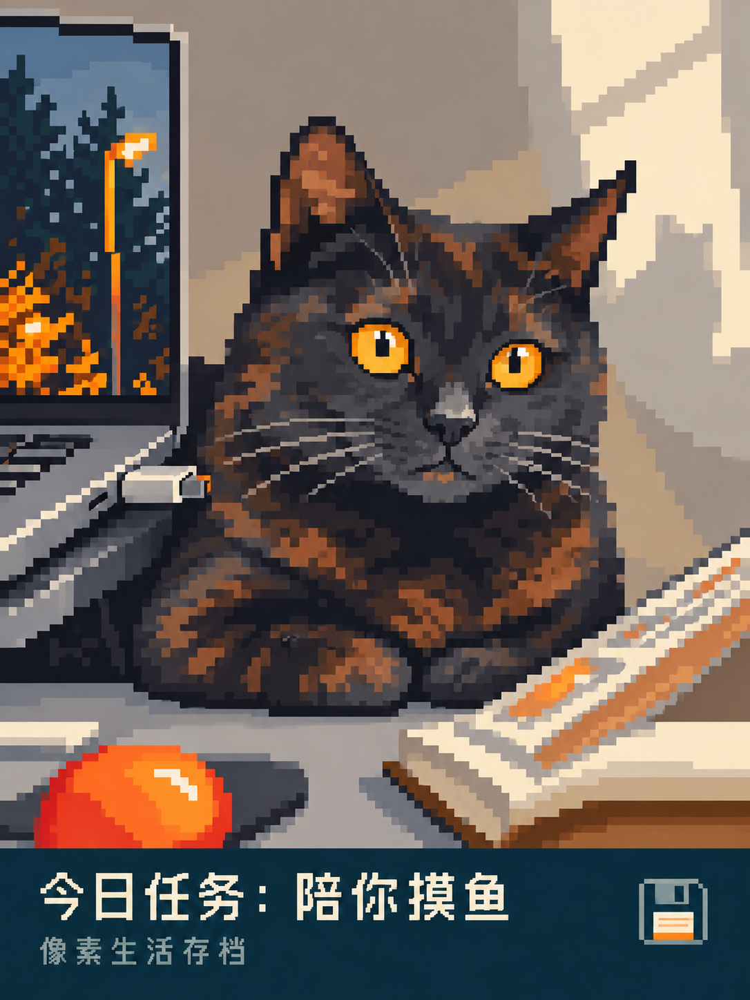
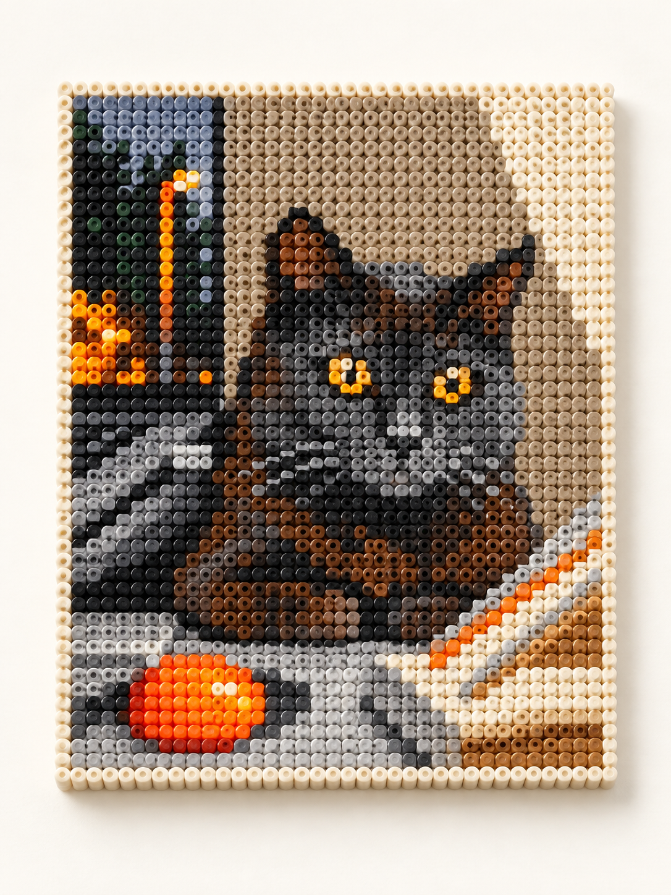

# Photo Playground · 把日常做成想分享的作品

十三款免费照片 Skills。从一张随手拍出发，做一页小报、一幅版画、一张悬赏令，或者一段有电影感的日常。

[English](README.en.md) · [下载独立安装包](https://github.com/TREAFREE/photo-playground/releases/latest) · [豆包实测与用法](docs/doubao.md) · [全部验证记录](docs/skill-status.md)

**每款独立安装、独立修改。使用你自己的图片生成环境，无订阅、无额度销售。**

| 实景渐绘拼贴 | 建筑版画海报 | 像素生活存档 |
|---|---|---|
|  |  |  |

| 大航海悬赏令 | 拼豆纪念画 | 微型纸雕 |
|---|---|---|
|  |  |  |

[新款原图对照](examples/review-v0.6.0/README.md) · [更多实拍题材与成品](examples/review-v0.5.0/README.md)

## 选一个玩法

只安装喜欢的一款即可。点击“规则”可直接阅读完整创作方法。

| 玩法 | 适合的照片与效果 | 规则 / 下载 |
|---|---|---|
| 没什么大事日报 | 宠物、生活小事 → 冷幽默中文头版 | [规则](skills/small-news-daily/SKILL.md) · [ZIP](https://github.com/TREAFREE/photo-playground/releases/download/v0.6.0/small-news-daily.zip) |
| 私人生活博物馆 | 旧鞋、玩偶、食物 → 带展签的收藏海报 | [规则](skills/private-life-museum/SKILL.md) · [ZIP](https://github.com/TREAFREE/photo-playground/releases/download/v0.6.0/private-life-museum.zip) |
| 像素生活存档 | 宠物、风景 → 卡通像素生活场景 | [规则](skills/pixel-life-save/SKILL.md) · [ZIP](https://github.com/TREAFREE/photo-playground/releases/download/v0.6.0/pixel-life-save.zip) |
| 大航海悬赏令 | 宠物、肖像 → 搞笑漫画悬赏人物 | [规则](skills/pirate-bounty-poster/SKILL.md) · [ZIP](https://github.com/TREAFREE/photo-playground/releases/download/v0.6.0/pirate-bounty-poster.zip) |
| 日常电影剧照 | 生活场景 → 灯光与构图驱动的电影画面 | [规则](skills/everyday-film-still/SKILL.md) · [ZIP](https://github.com/TREAFREE/photo-playground/releases/download/v0.6.0/everyday-film-still.zip) |
| 微型纸雕 | 宠物、风景、食物 → 有层次的纸艺小世界 | [规则](skills/paper-scene-diorama/SKILL.md) · [ZIP](https://github.com/TREAFREE/photo-playground/releases/download/v0.6.0/paper-scene-diorama.zip) |
| 照片记忆册 | 个人照片 → 摊开的摄影书效果图 | [规则](skills/photo-memory-book/SKILL.md) · [ZIP](https://github.com/TREAFREE/photo-playground/releases/download/v0.6.0/photo-memory-book.zip) |
| 日常说明书 | 日常物品 → 一本正经的趣味说明书 | [规则](skills/everyday-user-manual/SKILL.md) · [ZIP](https://github.com/TREAFREE/photo-playground/releases/download/v0.6.0/everyday-user-manual.zip) |
| 拼豆纪念画 | 照片 → 有塑料颗粒触感的拼豆纪念画 | [规则](skills/bead-memory-tile/SKILL.md) · [ZIP](https://github.com/TREAFREE/photo-playground/releases/download/v0.6.0/bead-memory-tile.zip) |
| 单双色网点海报 | 宠物、物件 → 大字与网点印刷海报 | [规则](skills/spot-ink-editorial/SKILL.md) · [ZIP](https://github.com/TREAFREE/photo-playground/releases/download/v0.6.0/spot-ink-editorial.zip) |
| 摄影与微小诗意 | 风景、生活 → 摄影与小幅手绘的留白双联 | [规则](skills/photo-poetry-diptych/SKILL.md) · [ZIP](https://github.com/TREAFREE/photo-playground/releases/download/v0.6.0/photo-poetry-diptych.zip) |
| 实景渐绘拼贴 | 建筑、旅行、日常 → 摄影逐渐延伸成纸上线描 | [规则](skills/scene-sketch-collage/SKILL.md) · [ZIP](https://github.com/TREAFREE/photo-playground/releases/download/v0.6.0/scene-sketch-collage.zip) |
| 建筑版画海报 | 屋檐、窗、楼梯 → 黑墨与刻线的建筑版画 | [规则](skills/architectural-relief-poster/SKILL.md) · [ZIP](https://github.com/TREAFREE/photo-playground/releases/download/v0.6.0/architectural-relief-poster.zip) |

## 在 Codex 中使用

给能访问本地文件和图片编辑工具的 Codex 发送：

```text
请从 https://github.com/TREAFREE/photo-playground 安装 scene-sketch-collage。
只安装这一款，保留它完整的独立目录；若已有同名 Skill，先保留我的本地修改。
```

安装后附上一张照片：

```text
使用 $scene-sketch-collage 处理这张照片，做成摄影渐绘拼贴，文字用英文。
```

换成表中其他名称即可切换风格。也可以指定“纯图无字”、准确标题或一段真实经历。手动安装时，从 Releases 解压同名目录到当前 Codex 配置的 Skills 目录，重新打开会话确认可发现；无需把全部仓库作为一个 Skill 安装。

## 在豆包中使用

**实测可通过“照片＋Skill 正文”生成建筑版画；没有验证成功从 GitHub 自动安装。**

上传一张照片，粘贴对应“规则”页面的正文，前面加：

```text
请严格按下面的创作规则直接生成一张成品图，不要只介绍风格。
```

有 references 引用的 Skill 需要一并提供引用内容。不同模型的字体、留白和保真度会有差异；本轮豆包把黑色窄体标题改成了红色衬线标题。[完整步骤与实际测试范围](docs/doubao.md)。

## 看样例，也看测试范围

仓库全部十三款都有 Codex 图片工具生成的样例；新增两款目前只覆盖建筑和长椅等少量输入。漂亮样例不等于任意照片稳定成功，具体版本、题材数与缺陷见 [状态表](docs/skill-status.md)。

- 生成式编辑可能改动人脸、纹理、建筑细节；请检查重要辨识特征。
- 文字可能需要一次修订；短标题通常更容易核对。
- 拼豆是视觉效果，记忆册是图片效果，版画与网点海报是风格图；尚不提供逐格工艺图纸、翻页软件或印刷分色文件。

## 免费开源，独立维护

原创规则与代码使用 [MIT 许可](LICENSE)。生成能力和费用由你自己的平台提供，本仓库不提供 API Key 或托管推理。

十三款拥有各自的文件、版本和 ZIP，更新一款不需要覆盖其他款。[独立维护说明](docs/skill-isolation.md) · [机器可读目录](skills-catalog.json) · [贡献方式](CONTRIBUTING.md)。

如果你愿意分享作品，欢迎 Star 或提交 Issue，并注明使用的 Skill、模型和遇到的问题。只公开你愿意公开的照片。未来赞助会明确标注，不插入用户成品；当前无赞赏收款入口或赞助商。

第三方照片及含其内容的样例不纳入 MIT：[照片作者与许可](examples/sources/README.md)。参考项目仅用于研究，不捆绑其规则与资产：[本轮研究](research/reference-styles-2026-09-09.md)。
