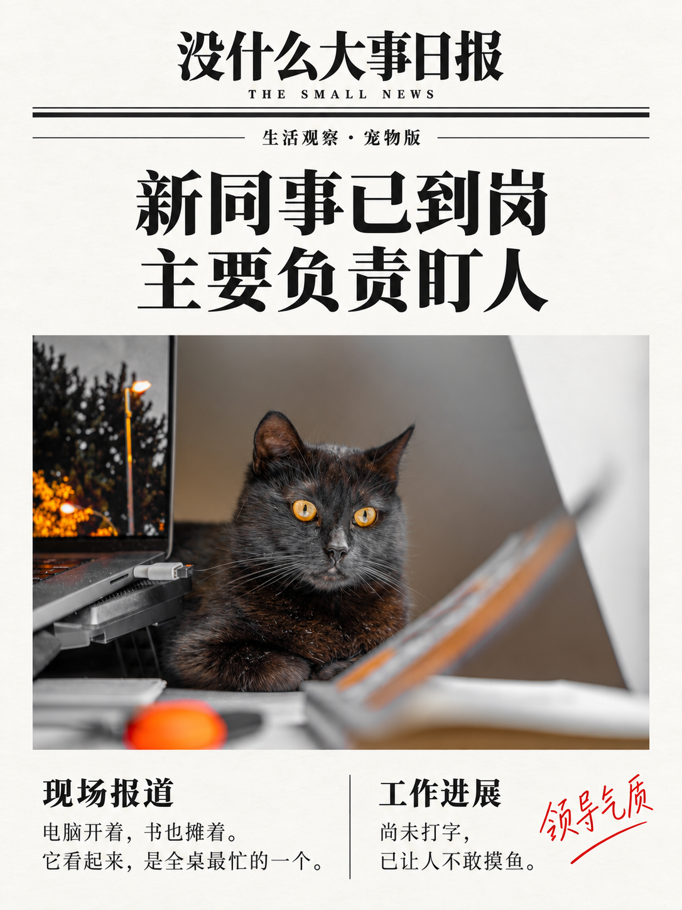
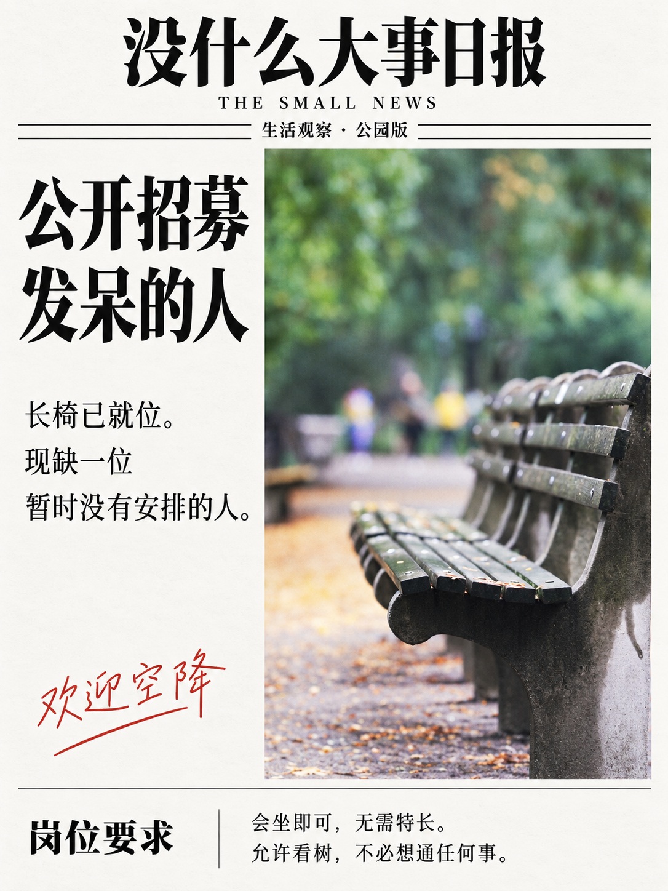
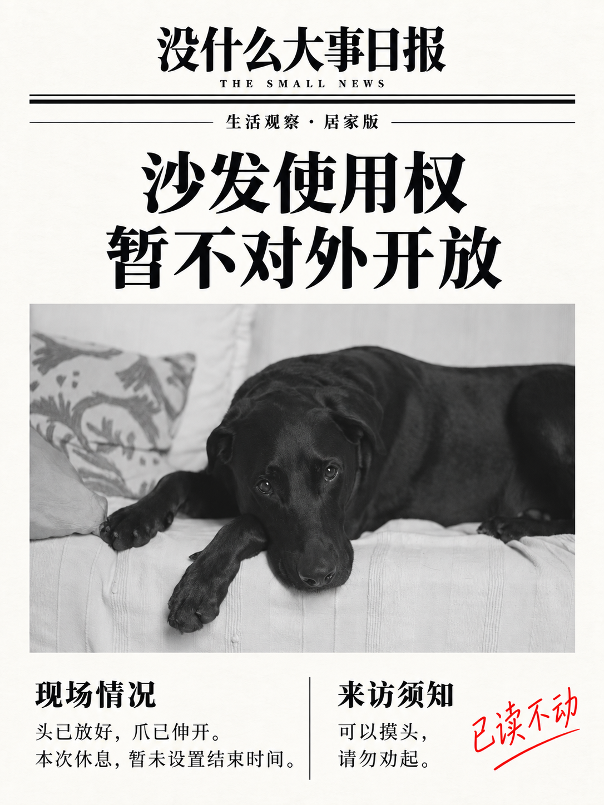
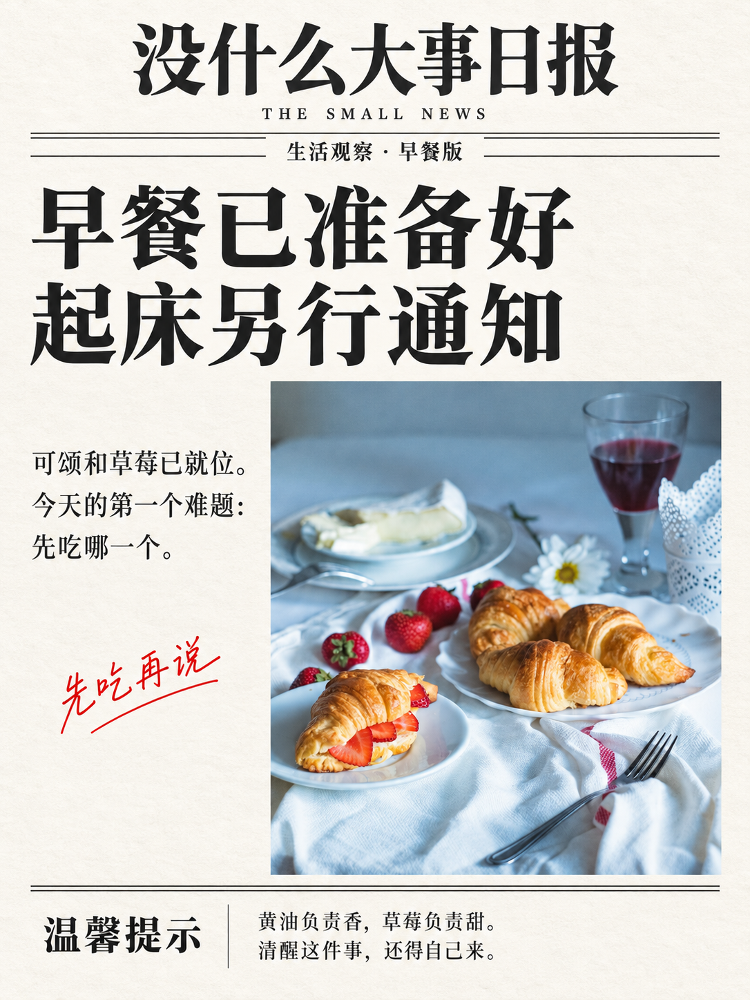
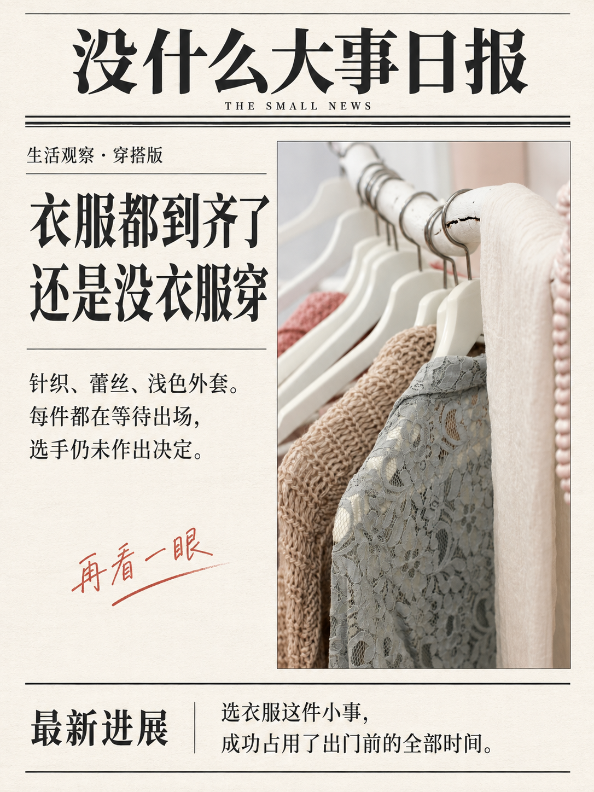
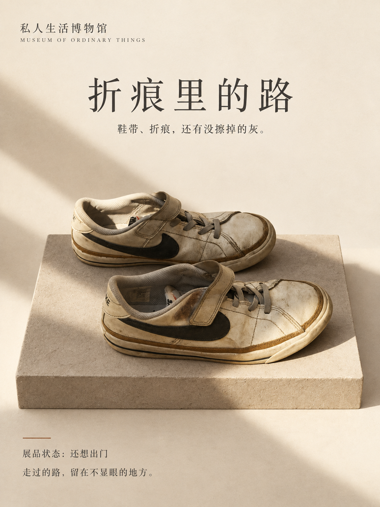
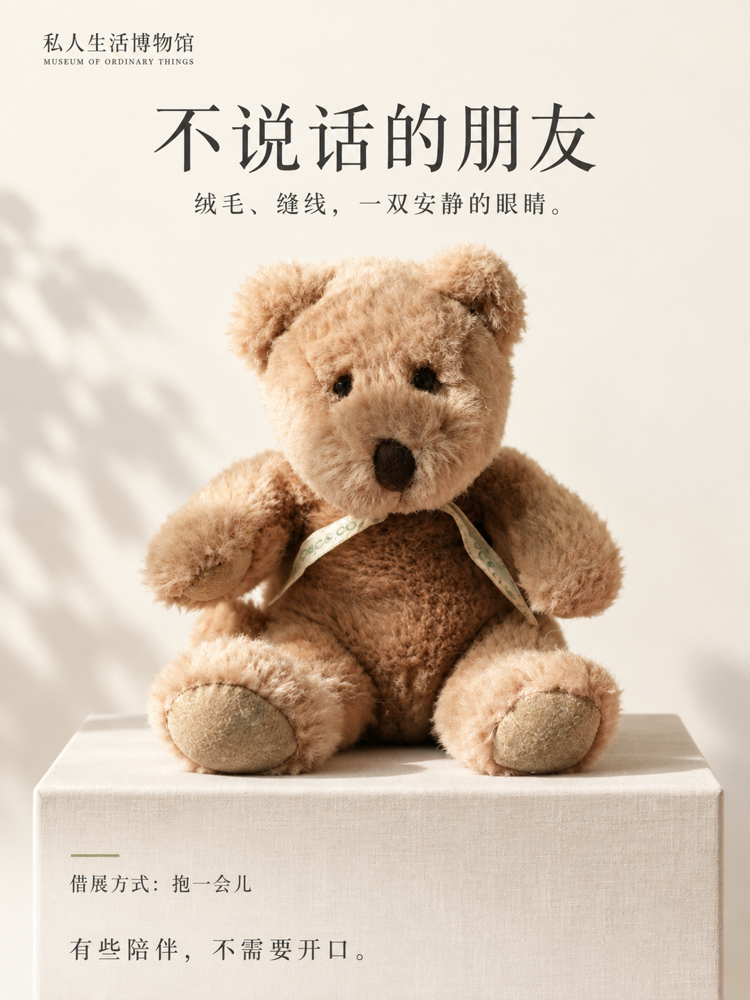
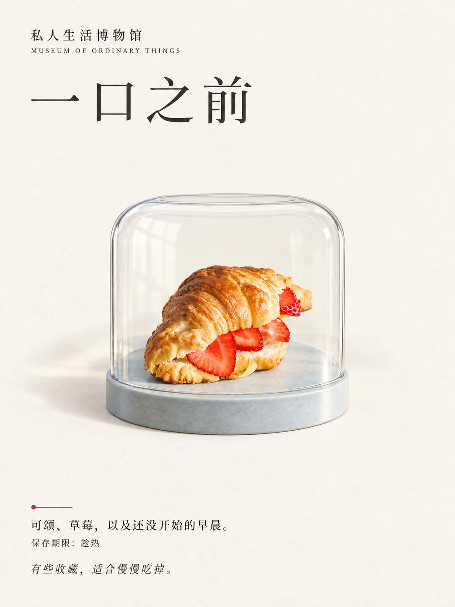

# Photo Playground · 生活照片的两种玩法

**小事可以登上头版，旧物也值得认真收藏。**

两个原创照片 Skills：冷幽默的《没什么大事日报》，以及温柔的《私人生活博物馆》。

[English](README.en.md) · [下载 Skill](https://github.com/TREAFREE/photo-playground/releases/latest) · [查看写法](skills/small-news-daily/SKILL.md)

## 没什么大事日报

把照片里的小事，认真登上头版。

| 新同事已到岗，主要负责盯人 | 公开招募发呆的人 |
|---|---|
|  |  |

## 再普通一点，也可以上报纸

| 沙发使用权，暂不对外开放 | 早餐已准备好，起床另行通知 | 衣服都到齐了，还是没衣服穿 |
|---|---|---|
|  |  |  |

以上是同一个 Skill 在不同照片上的实际生成结果。它先观察照片，写专属文案，再根据横竖构图排版。

## 私人生活博物馆

把普通物件做成一张有展签的收藏海报。旧鞋保留折痕，玩偶保留自己的脸；台座、光线和展陈场景重新创作。

| 折痕里的路 | 不说话的朋友 | 一口之前 |
|---|---|---|
|  |  |  |

[Skill 写法](skills/private-life-museum/SKILL.md) · [展陈规范](skills/private-life-museum/references/exhibition.md) · [实际审片](evals/museum-review.md)

## 怎么用

需要能读取 Skill 文件、查看照片并调用**参考图片编辑工具**的 Agent 环境。仅有文字聊天能力不能生成这些图片。本项目在 Codex 内置图片工具中实测，未承诺其他模型或客户端的兼容性。

在 [Releases](https://github.com/TREAFREE/photo-playground/releases/latest) 下载想用的 `small-news-daily.zip` 或 `private-life-museum.zip`，解压后将同名文件夹放进你的 Skills 目录。

也可以从源码安装（macOS/Linux，在终端执行）：

```bash
git clone https://github.com/TREAFREE/photo-playground.git
cd photo-playground
mkdir -p ~/.codex/skills
cp -R skills/small-news-daily ~/.codex/skills/
cp -R skills/private-life-museum ~/.codex/skills/
```

如果已经安装过同名 Skill，先备份自己的修改再更新。

附上一张照片，输入：

> 使用 $small-news-daily，把这张照片做成《没什么大事日报》，有一点冷幽默，文字用中文。

或者：

> 使用 $private-life-museum，把照片里的物件做成《私人生活博物馆》，保留它的使用痕迹，展签用中文。

可以加一句你的真实经历，比如“今天周末，我的狗不肯出门”。也可以指定报纸名字、文案或语言。

## 免费，使用自己的生成环境

Skill 原创文字与配置采用 MIT 许可，无功能锁、订阅或生成额度销售。图片生成消耗你所使用平台的额度或费用；仓库不提供模型、API Key 或托管推理服务。

如果作品让你开心，欢迎 Star，或在 [Discussions](https://github.com/TREAFREE/photo-playground/discussions) 分享你愿意公开的作品。

## 效果边界

- 生成式编辑会改变部分照片细节，不能保证人脸、宠物纹理或原图像素完全一致。
- 小报测试了 5 张源照片；博物馆测试了可颂、旧鞋、小熊 3 个题材（复用 1 张源照片）。这不是任意照片成功率或用户分享率的统计结论。
- 中文偶尔可能出现错误；Skill 包含审片和一次针对性修订流程。
- 报道属于虚构生活小报，不代表摄影师、照片主体或真实新闻机构的陈述。

## 想研究或参与

- [Skill 工作流](skills/small-news-daily/SKILL.md) / [视觉规范](skills/small-news-daily/references/art-direction.md)
- [照片 Skills 调研](research/landscape.md)
- [第一轮审片](evals/review.md) / [扩展测试](evals/round-2-review.md)
- [原照片与作者](examples/sources/README.md) / [生成提示词](evals/)
- [贡献方式](CONTRIBUTING.md)

`photo-playground` 是这组原创照片玩法的仓库。当前发布了《没什么大事日报》和《私人生活博物馆》，逐个打磨后再增加新玩法。

## 许可与支持

原创 Skill、配置和代码见 [MIT LICENSE](LICENSE)。第三方源照片以及含其内容的示例媒体保留对应来源许可，不纳入 MIT；摄影师与链接见来源清单。本仓库不复制参考项目的 Skill 或视觉资产。

项目可通过自愿赞助支持维护，当前没有赞助商或赞赏收款入口。未来商业赞助会明确标注，不进入用户成品、不要求更换模型。
