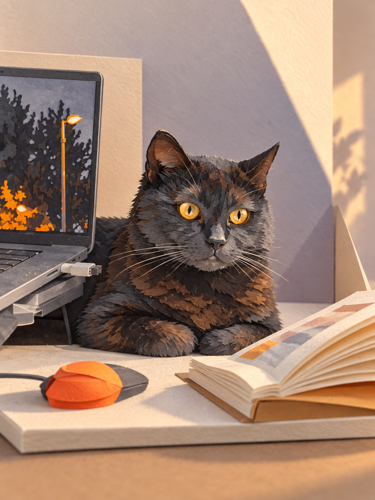
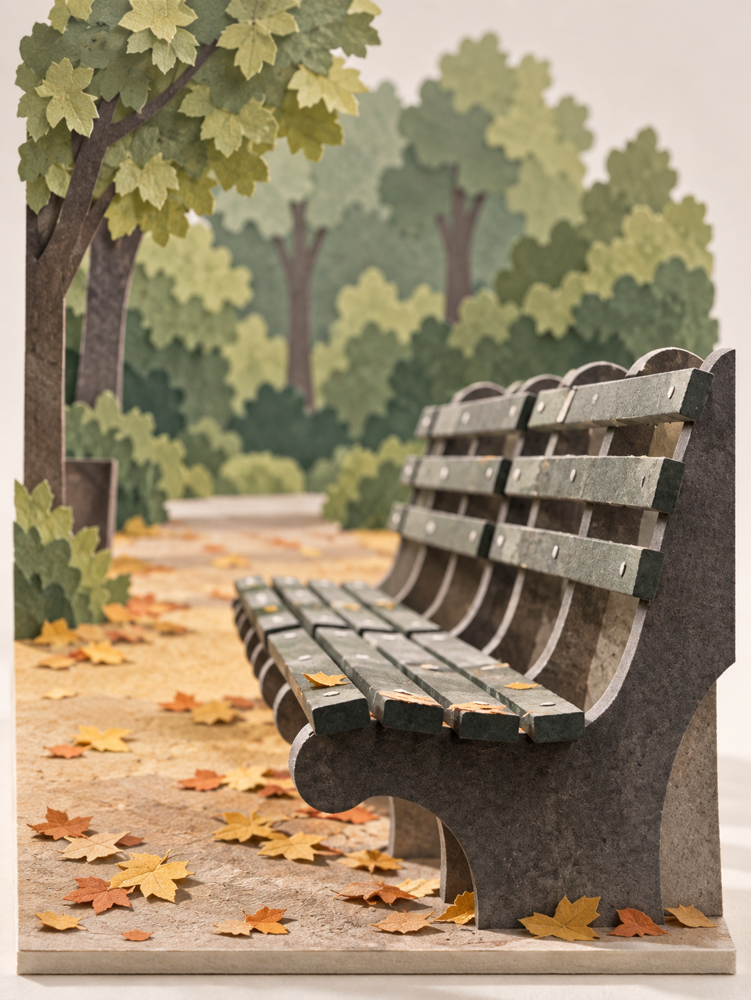
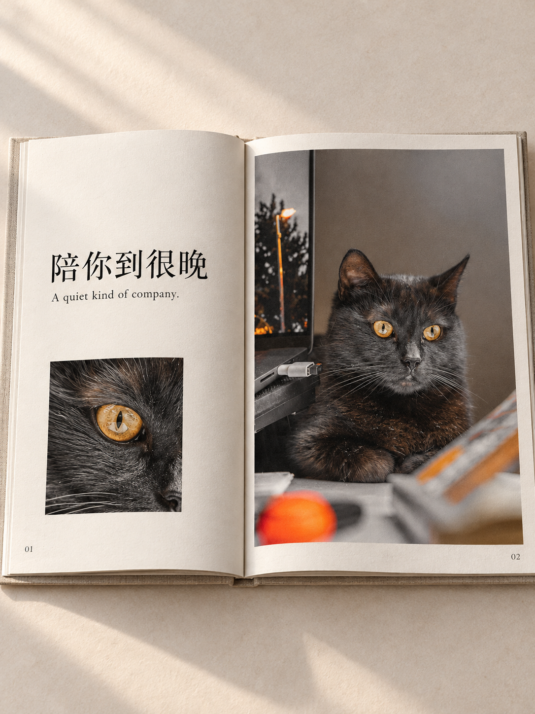
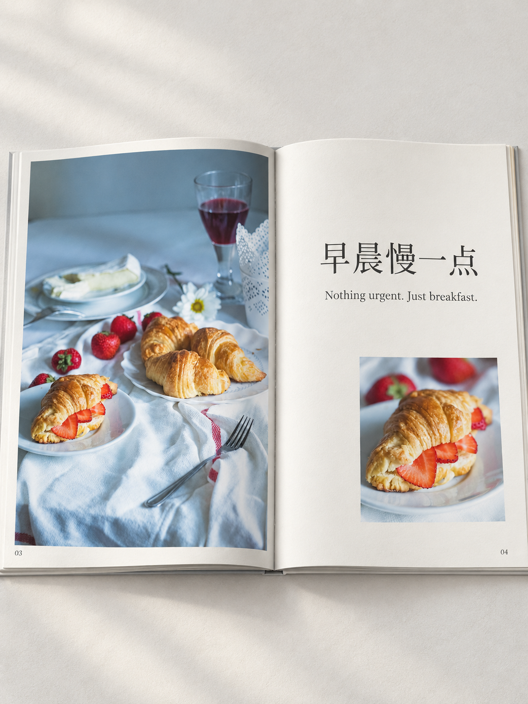
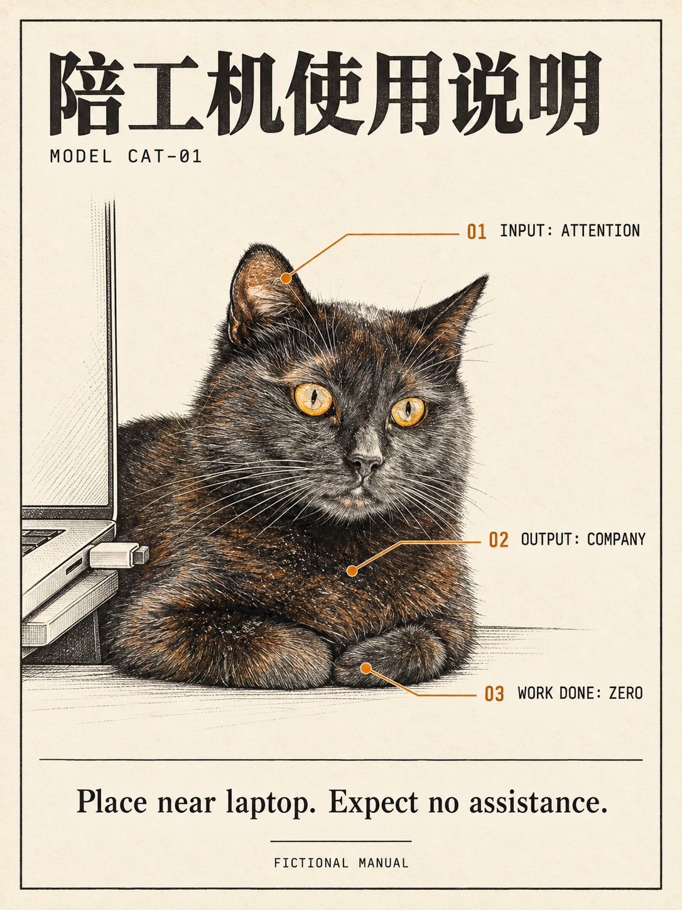
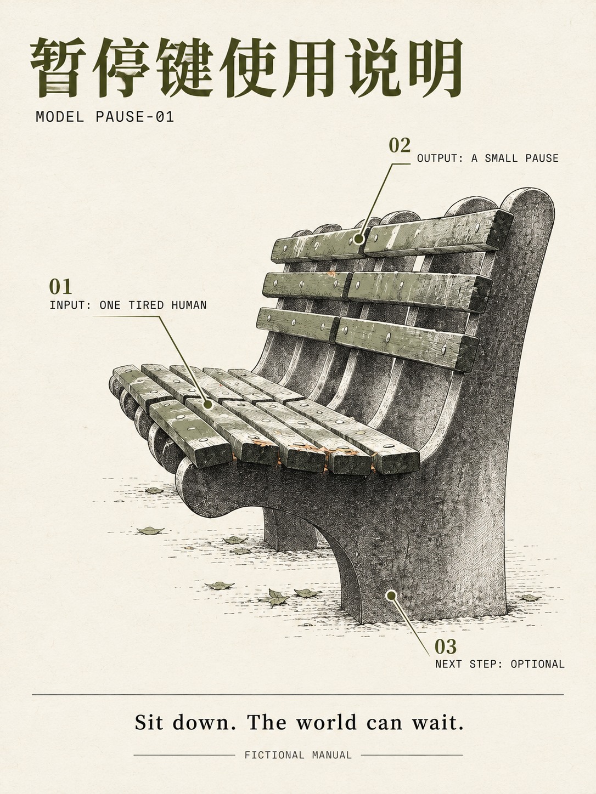

# 三款新玩法 · 统一检查

本轮三款均已完成独立 Skill、两个题材样例和安装包，已收录到 v0.4.0，供下载测试和审美反馈。

[打开本地预览页](index.html) · [照片来源与许可](../sources/README.md)

本轮使用内置 image_gen，六次生成、六张候选成品，没有追加修订。提示词按各 Skill 的规则编写；没有进行独立代理调用或跨模型验证。

## 微型纸雕

[Skill](../../skills/paper-scene-diorama/SKILL.md) · [独立安装包](../../dist/paper-scene-diorama.zip) · [检查记录](../../evals/paper-scene-diorama/review.md)

### 桌边纸猫

琥珀眼、伏卧姿态和电脑/书本的位置清楚；猫的纸片较细密，更像精细纸模型。

[原照片](../sources/cat.jpg) · [实际提示词](../../evals/paper-scene-diorama/cat-v1-prompt.txt)

### 纸上公园

长椅弯曲骨架和前后景清楚；树叶被具体化，属于创意重构。

[原照片](../sources/bench.jpg) · [实际提示词](../../evals/paper-scene-diorama/bench-v1-prompt.txt)

## 照片记忆册

[Skill](../../skills/photo-memory-book/SKILL.md) · [独立安装包](../../dist/photo-memory-book.zip) · [检查记录](../../evals/photo-memory-book/review.md)

### 陪你到很晚

中英文及页码准确，主图与眼睛细节形成节奏；这是书册效果图，不是可翻页文件。

[原照片](../sources/cat.jpg) · [实际提示词](../../evals/photo-memory-book/cat-v1-prompt.txt)

### 早晨慢一点

四个牛角包及餐桌关系保留，中英文及页码准确；模型有重绘，不保证原照片像素不变。

[原照片](../sources/croissant.jpg) · [实际提示词](../../evals/photo-memory-book/croissant-v1-prompt.txt)

## 日常说明书

[Skill](../../skills/everyday-user-manual/SKILL.md) · [独立安装包](../../dist/everyday-user-manual.zip) · [检查记录](../../evals/everyday-user-manual/review.md)

### 陪工机使用说明

标题、三个英文标注和底部文案准确；标注对应耳朵、胸口和前爪。

[原照片](../sources/cat.jpg) · [实际提示词](../../evals/everyday-user-manual/cat-v1-prompt.txt)

### 暂停键使用说明

标题和英文文案准确，编号对应座面、靠背和椅腿；小字需要点开原尺寸查看。

[原照片](../sources/bench.jpg) · [实际提示词](../../evals/everyday-user-manual/bench-v1-prompt.txt)

## 验证记录

三个 Skill 结构校验、八个 ZIP 内容与校验和、七个来源与二十七个结果记录均通过；既有四项隔离测试通过。原有五款的二十一个规则/资源/安装包文件与修改前 SHA256 一致。

六张成品已逐张目视检查；HTML 资源与链接静态检查通过。浏览器安全策略阻止本地 file 页面访问，故 HTML 浏览器渲染未验证；可直接通过本清单查看图片。
