# v0.5.0 · 新风格与补测

三款新风格六张候选、既有七款七张补测；本轮共十五次出图，其中两次定向修订。全部使用内置 image_gen。截图用于理解风格，未作为本仓库公开图片或生成输入。

[版本与验证范围](../../docs/skill-status.md) · [照片来源](../sources/README.md)

## 三种新风格

### 拼豆纪念画 · cat

猫眼、电脑、书、鼠标可辨，孔洞清楚；局部珠形有生成变形，实际颜色及颗数没有逐格统计。

[来源照片](../sources/cat.jpg) · [完整提示词](../../evals/bead-memory-tile/cat-q1-prompt.txt) · [Skill](../../skills/bead-memory-tile/SKILL.md)

### 拼豆纪念画 · bench

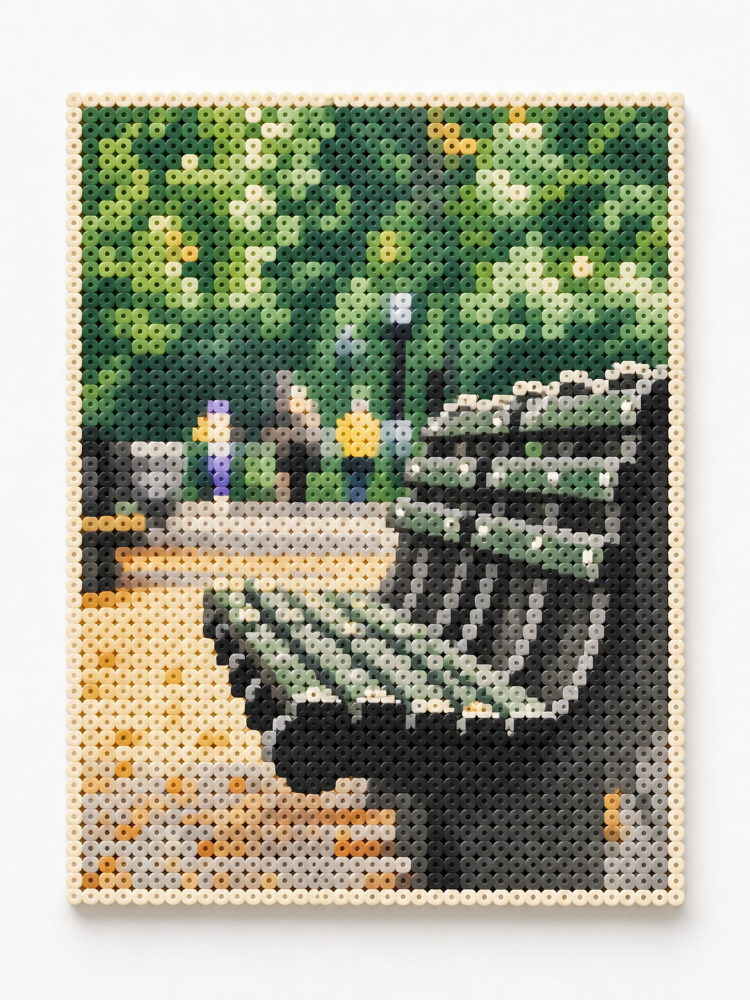

长椅和小径可辨，整体孔洞与排列一致；画面较复杂，局部细节简化，不能视作可施工图纸。

[来源照片](../sources/bench.jpg) · [完整提示词](../../evals/bead-memory-tile/bench-q1-prompt.txt) · [Skill](../../skills/bead-memory-tile/SKILL.md)

### 单双色网点海报 · dog

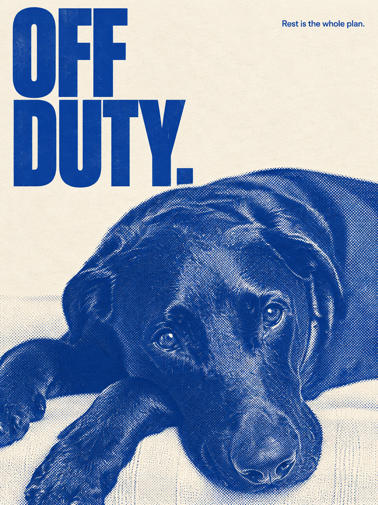

单色视觉成立，OFF DUTY. 与副句准确，眼睛口鼻未被裁掉；是网点效果，未做印刷分色检测。

[来源照片](../sources/dog.jpg) · [完整提示词](../../evals/spot-ink-editorial/dog-q1-prompt.txt) · [Skill](../../skills/spot-ink-editorial/SKILL.md)

### 单双色网点海报 · croissant

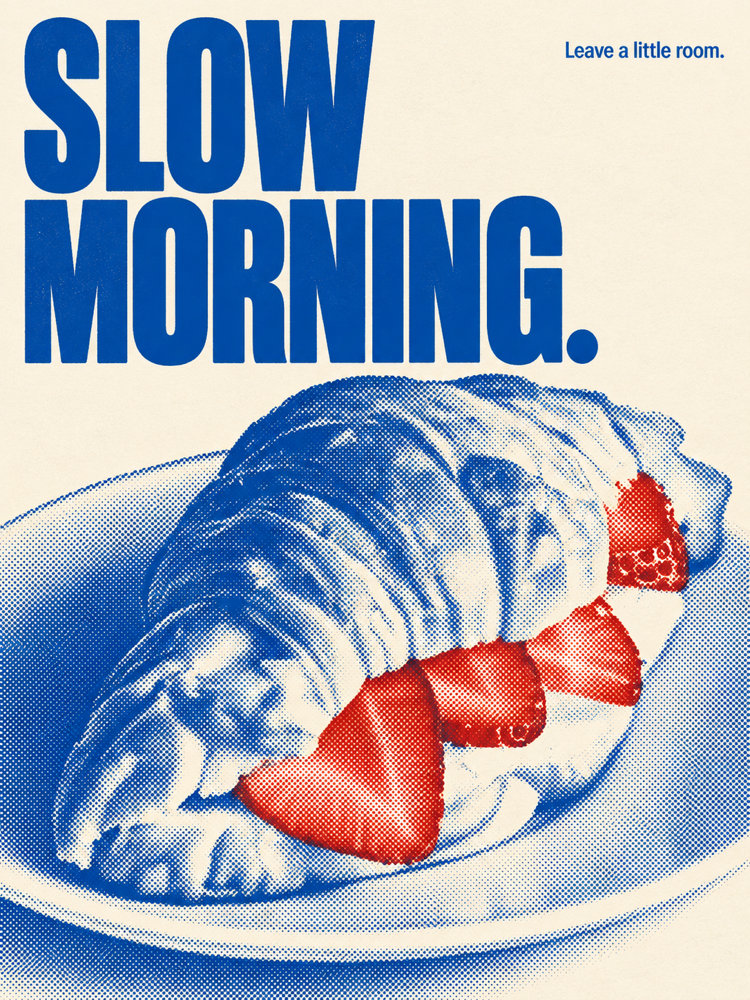

蓝色主墨、红色草莓重点成立，SLOW MORNING. 与副句准确；可颂形状可辨，未验证中文大字版本。

[来源照片](../sources/croissant.jpg) · [完整提示词](../../evals/spot-ink-editorial/croissant-q1-prompt.txt) · [Skill](../../skills/spot-ink-editorial/SKILL.md)

### 摄影与微小诗意 · bench

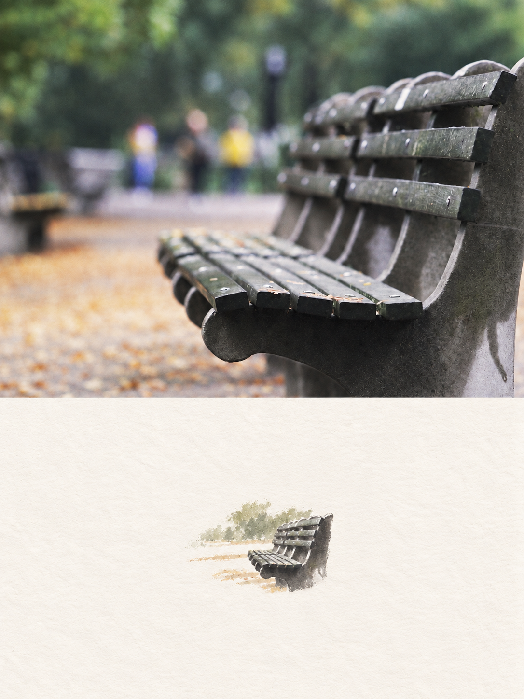

首稿插画偏大且上半约占 57%；修订缩小插画改善留白，分割线仍约 57/43，未达到精确五五。

[来源照片](../sources/bench.jpg) · [完整提示词](../../evals/photo-poetry-diptych/bench-q2-prompt.txt) · [Skill](../../skills/photo-poetry-diptych/SKILL.md)

### 摄影与微小诗意 · cat

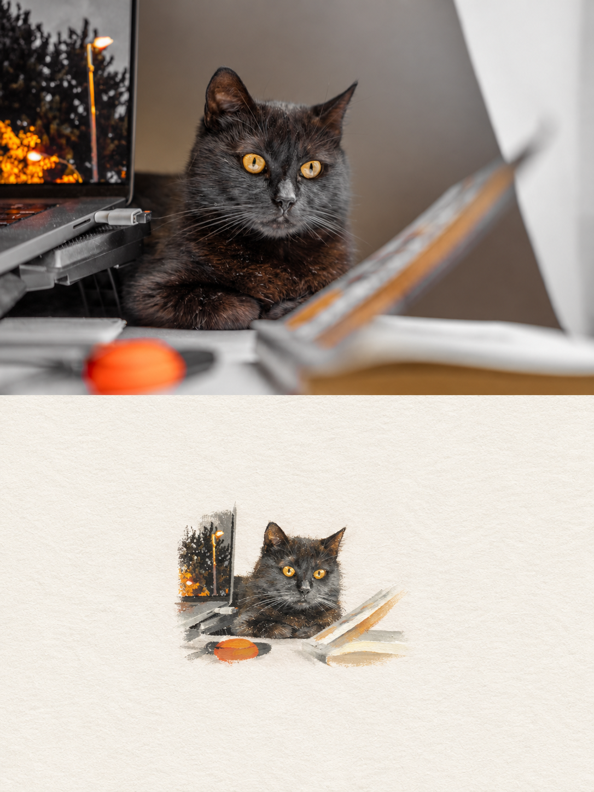

猫咪姿态及电脑/书/鼠标关系一致，上下约各半，插画较小；细节仍偏精细干笔，未保证原片像素不变。

[来源照片](../sources/cat.jpg) · [完整提示词](../../evals/photo-poetry-diptych/cat-q1-prompt.txt) · [Skill](../../skills/photo-poetry-diptych/SKILL.md)

## 原有七款补测

### 私人生活博物馆 · wardrobe

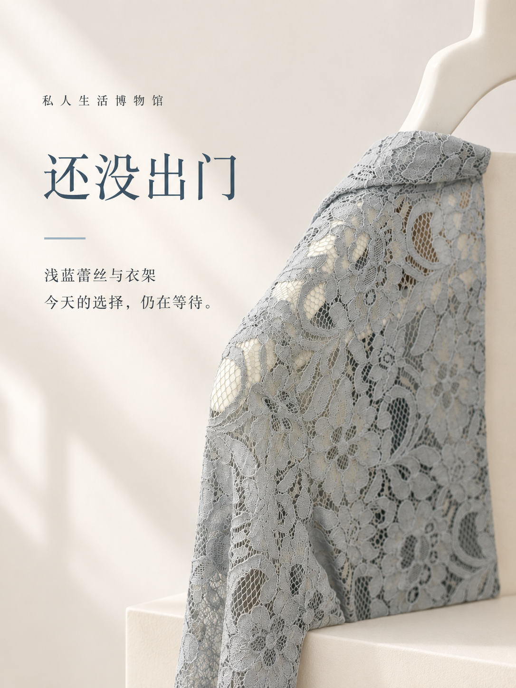

选中了浅蓝蕾丝，标题与展签准确；比既有台座例更偏近景展陈，裁切衣架且并非完整服装，不能当作原衣物全貌。

[来源照片](../sources/wardrobe.jpg) · [完整提示词](../../evals/private-life-museum/wardrobe-q1-prompt.txt) · [Skill](../../skills/private-life-museum/SKILL.md)

### 像素生活存档 · dog

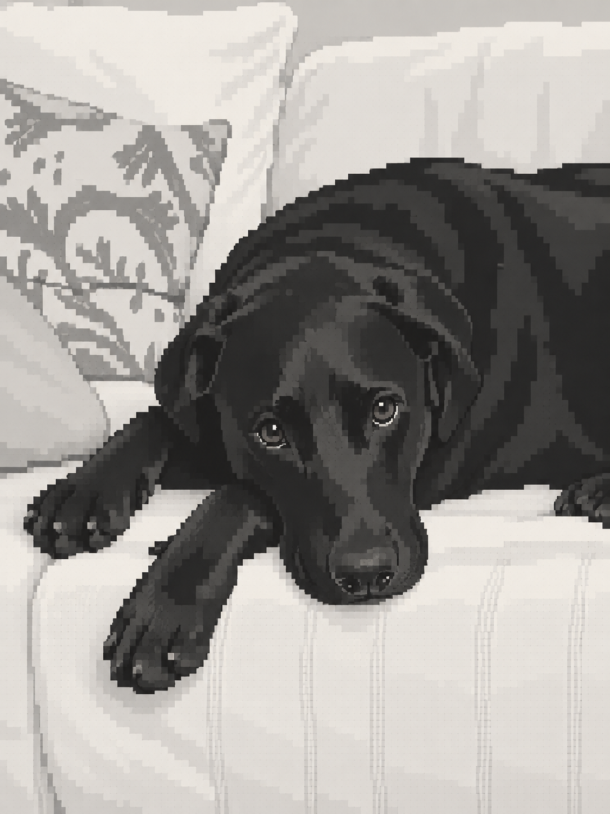

黑白狗狗眼睛、垂耳、伏卧与沙发关系保留，无字模式成功；风格偏写实像素，尚不代表所有宠物都能得到同等卡通感。

[来源照片](../sources/dog.jpg) · [完整提示词](../../evals/pixel-life-save/dog-q1-prompt.txt) · [Skill](../../skills/pixel-life-save/SKILL.md)

### 大航海悬赏令 · teddy

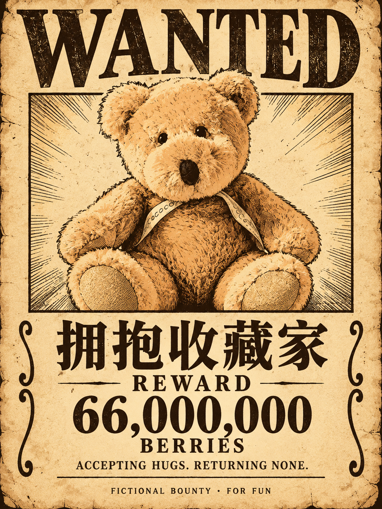

正确选择中央棕色玩偶，未混入右侧黄熊；中文称号、英文理由、66,000,000 金额准确，纸面做旧较明显。

[来源照片](../sources/teddy.jpg) · [完整提示词](../../evals/pirate-bounty-poster/teddy-q1-prompt.txt) · [Skill](../../skills/pirate-bounty-poster/SKILL.md)

### 日常电影剧照 · wardrobe

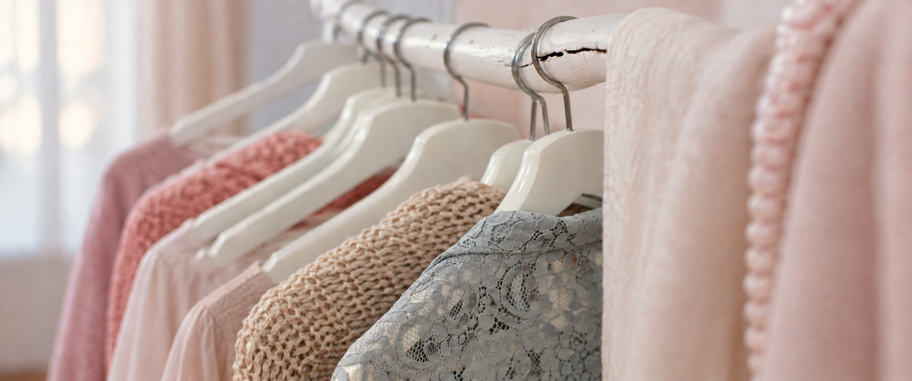

首稿左侧扩图增加模糊植物，已保留失败记录；修订去掉植物，衣架、蕾丝和针织关系保留。画面叙事较弱，定位电影空镜。

[来源照片](../sources/wardrobe.jpg) · [完整提示词](../../evals/everyday-film-still/wardrobe-q2-prompt.txt) · [Skill](../../skills/everyday-film-still/SKILL.md)

### 微型纸雕 · croissant

四个可颂和主要餐具位置保留，材料转换一致；部分餐布更像压纹纸、杯子呈折纸透明材质，不宣称可手工制造。

[来源照片](../sources/croissant.jpg) · [完整提示词](../../evals/paper-scene-diorama/croissant-q1-prompt.txt) · [Skill](../../skills/paper-scene-diorama/SKILL.md)

### 照片记忆册 · teddy

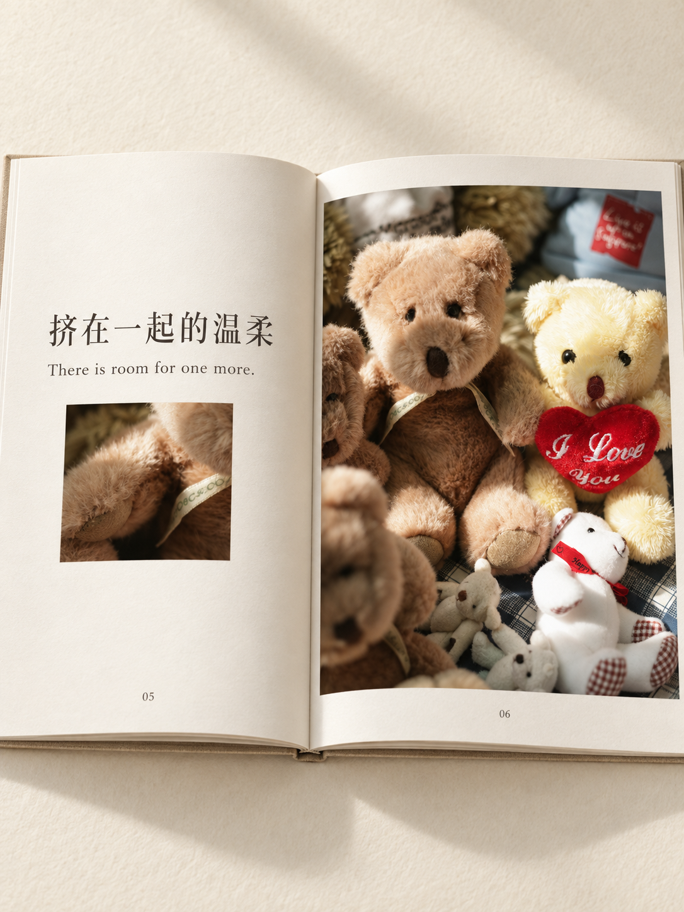

中文长标题及英文准确，玩偶组合未合并为一体；细节图选中同一棕熊，多图跨照片编排仍未测试。

[来源照片](../sources/teddy.jpg) · [完整提示词](../../evals/photo-memory-book/teddy-q1-prompt.txt) · [Skill](../../skills/photo-memory-book/SKILL.md)

### 日常说明书 · sneakers

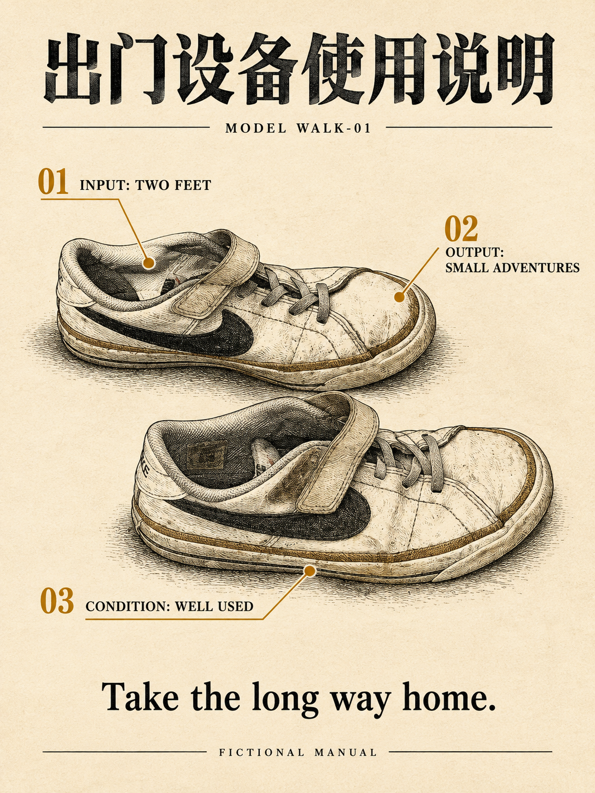

两只鞋、鞋带/搭扣、旧鞋底保留；标题与标注正确，三条线对应鞋口、鞋头、鞋底；品牌没有提升为海报标题。

[来源照片](../sources/sneakers.jpg) · [完整提示词](../../evals/everyday-user-manual/sneakers-q1-prompt.txt) · [Skill](../../skills/everyday-user-manual/SKILL.md)
