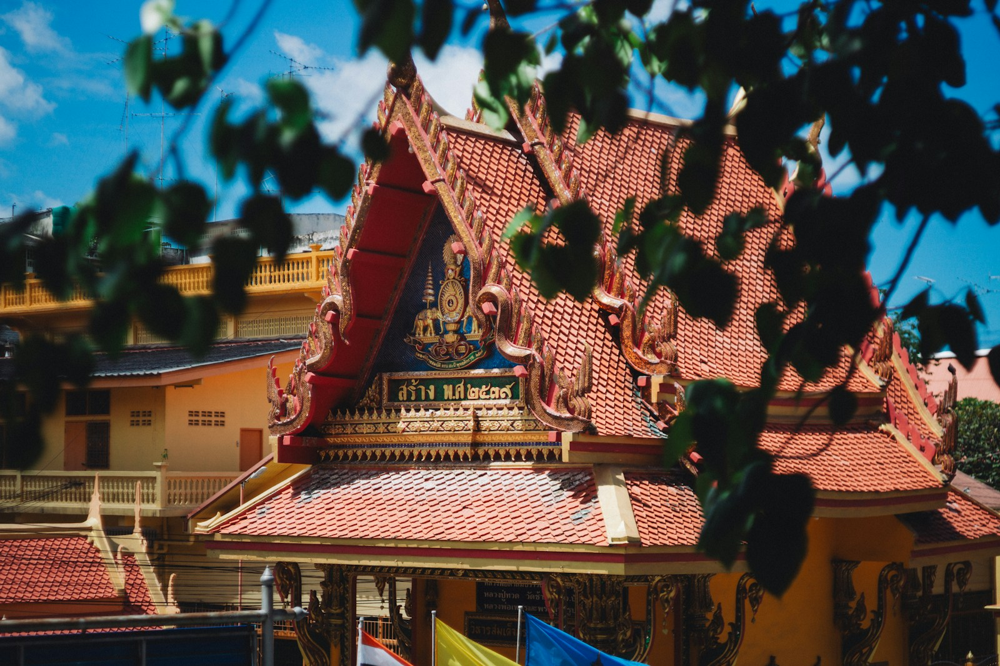
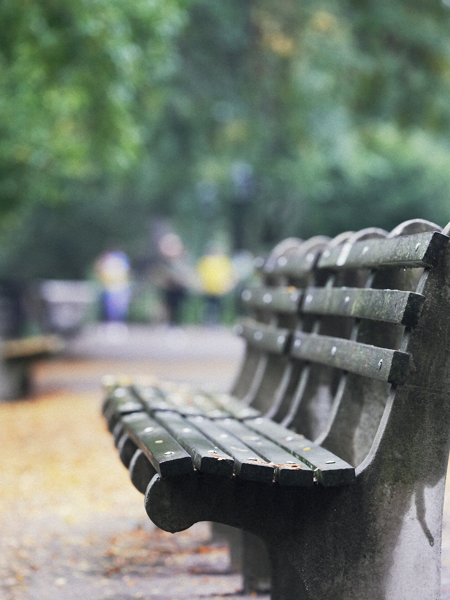
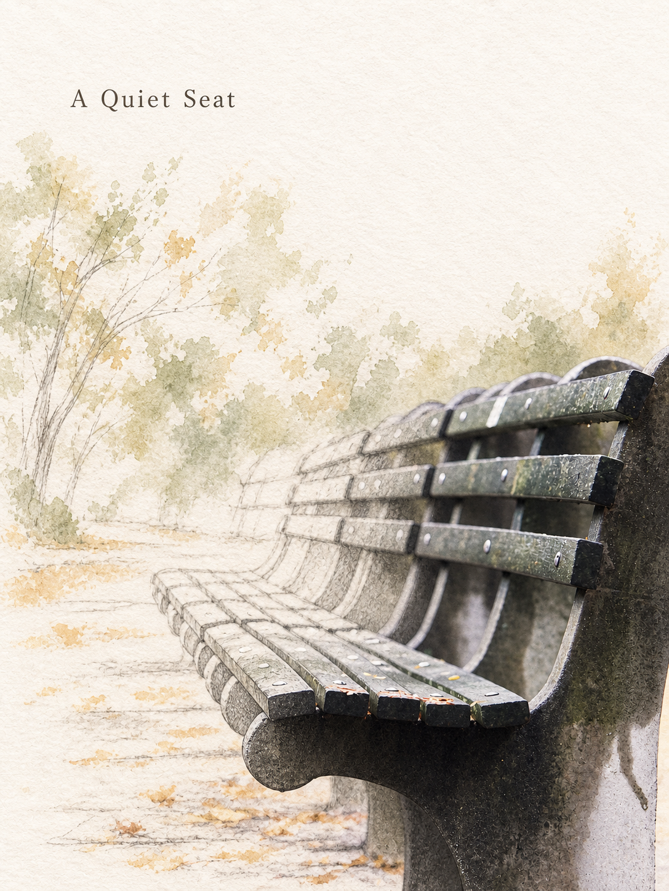

# v0.6.0：新风格审阅

两款独立 Skill，三张 Codex 首轮样例。照片来自独立授权来源，未使用社交平台截图作为生成主体。具体提示词、尺寸和哈希保存在各自 evals 目录。

| 原照片 | 实景渐绘拼贴 | 建筑版画 |
|---|---|---|
|  |  |  |

| 原照片 | 实景渐绘拼贴 |
|---|---|
|  |  |

[渐绘审片](../../evals/scene-sketch-collage/quality-review.md) · [版画审片](../../evals/architectural-relief-poster/quality-review.md) · [豆包实际测试](../../docs/doubao.md)

建筑渐绘的线描存在重复轮廓，已在规则中增加连续转绘约束，尚未对该约束重新出图。版画图的主体偏满。所有样例展示实际结果，不作为任意输入稳定性保证。
