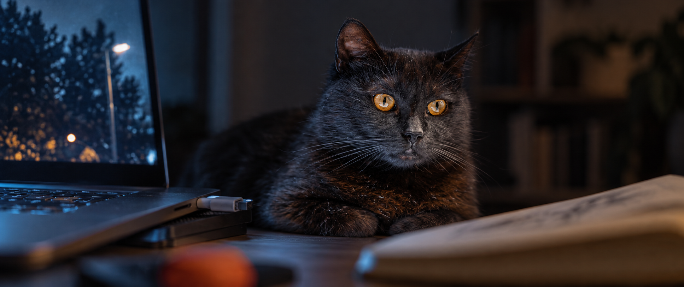
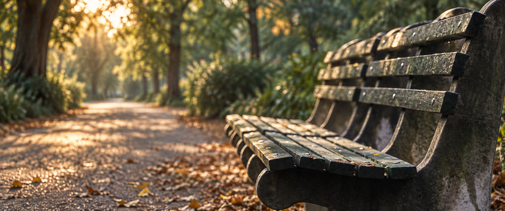

# 日常电影剧照 · 首轮试作

用户选择下一款方向为“电影剧照”。本地独立实验，尚未发布。用原照片作为主体参考，通过镜头位置、焦点、光源和颜色建立电影情绪。

- [Skill](skill/everyday-film-still/SKILL.md)
- [摄影规范](skill/everyday-film-still/references/cinematography.md)
- [原照片与许可](../../examples/sources/README.md)

初始题材为深夜桌边猫与黄昏空长椅，默认无字幕。不代表真实电影截图，源场景和细节属于创意重构。

## 首轮画面

**深夜陪伴**

**黄昏空镜**

[实际提示词与尺寸清单](evals/manifest.json) · [审片](evals/review.md)

两张使用内置 image_gen 生成，均为本地初稿；电影感和分享意愿尚待用户评价。
