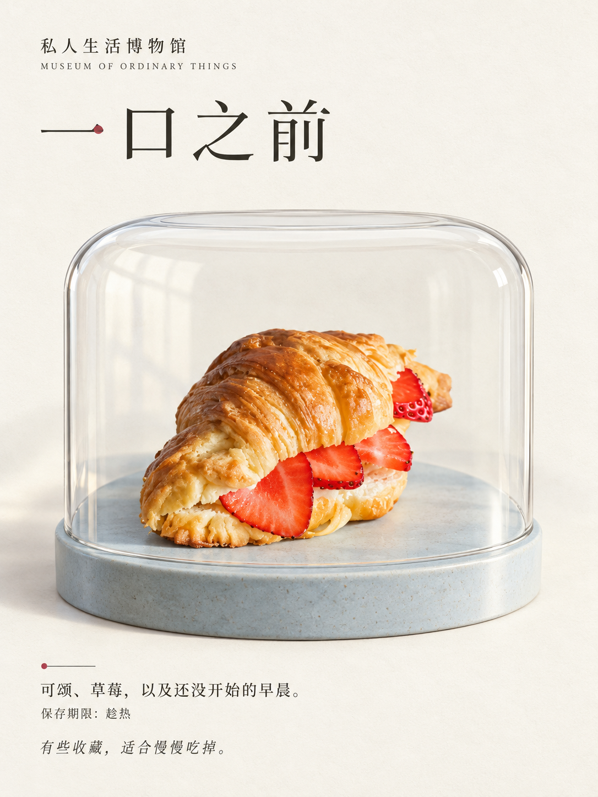

# 私人生活博物馆 · 第二个效果草稿

把生活里舍不得略过的一件小东西，认真当作展品。

状态：本地实验，尚未发布。v0.1.0 的稳定效果仍只有《没什么大事日报》。

这次探索更唯美的方向：从源照片选择一个有辨识度的普通物件，生成一张带原创展陈与小展签的艺术海报。照片为主体形态参考，场景属于明确的创意重构；不会宣称原片无损。

首个测试输入：已有早餐样本中左前方的草莓夹心可颂，摄影师 Diliara Garifullina；[来源与许可](../../examples/sources/README.md)。

可用 Skill 草稿位于 [private-life-museum](skill/private-life-museum/SKILL.md)。本次只制作一个首张原型；验证后才决定是否扩充或发布。

[实际提示词](evals/croissant-v1-prompt.txt) · [首稿审片](evals/review.md)
